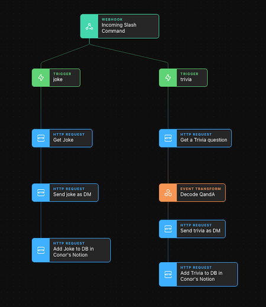

# Tines Community Fun Stories
There is still so much you can learn from these lightweight or lighthearted Stories. We'll be adding lots in the coming months. Watch this Repo to be notified of new ones.

## Getting Started

1. Sign-up for an always-free [Tines Community Edition Account](https://www.tines.com/?utm_source=marketing&utm_medium=github&utm_campaign=communitystories)
2. Save the JSON of the Story you are interested in (make sure to click the RAW link and then do Save-As)
3. Import it into your Tines Account
4. Read the instructions here or inside the Story on how to configure it
5. Let us know how you get on via [Twitter](https://twitter.com/tines_io/), [LinkedIn](https://www.linkedin.com/company/tines-io) or Community Slack

## The Stories
1. [Bones Day Email](bones-day-email) - Is it a #BonesDay or a #NoBonesDay?

