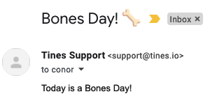

# Bones Day Email
When [Conor O'Donnell](https://twitter.com/ronocod/status/1451245649597550595) from the [Tines Engineering team](https://twitter.com/TinesEng) woke up last Thursday, he only had one question - Is today a [#NoBonesDay](https://twitter.com/NoodlesBonesDay/status/1451180572433334276) or a [#BonesDay](https://twitter.com/NoodlesBonesDay/status/1452261222376775680).

Like all good Tinos, he felt compelled to dogfood (sorry) the answer. A very very short while later, he announced "Bones Day Email" on our internal Slack.

Rather than keep this revolutionary solution to ourselves, we decided to share it to the world, so you too can get an email every morning letting you know which kind of day it is.

Originally our Step 1 was "Register as a Twitter Developer" until we discovered that this now involves the [Spanish Inquisition](https://www.youtube.com/watch?v=CV11t_qYikg) and many many emails explaining why you like pugs. 

So we've made things even easier for you.

* Sign up to our always-free [Community Edition](https://www.tines.com/?utm_source=marketing&utm_medium=github&utm_campaign=bonesdayemail)
* Download [our simplified Tines Story](https://raw.githubusercontent.com/tines/community-stories/main/fun/bones-day-email/easy-bones-day.json) and import as a new Story into your Tines Account
* Create a Resource called `Bones Email` and set it to your email address
* Publish your Story to make schedulable
* Click on the first Action and edit the Schedule to one that suits you
* Done!

Any problems, let us know on [Twitter](https://twitter.com/tines_io/) or [LinkedIn](https://www.linkedin.com/company/tines-io)

Gif by [Stefanie Shank](https://giphy.com/gifs/qJfDnSZD1wYZdFm4sw)

(Of course if you have a Twitter Developer Account, just go ahead and use [Conor's original Story](https://raw.githubusercontent.com/tines/community-stories/main/fun/bones-day-email/bones-day-email.json) and set the `Twitter Token` Credential and `Bones Email` Resource.)

