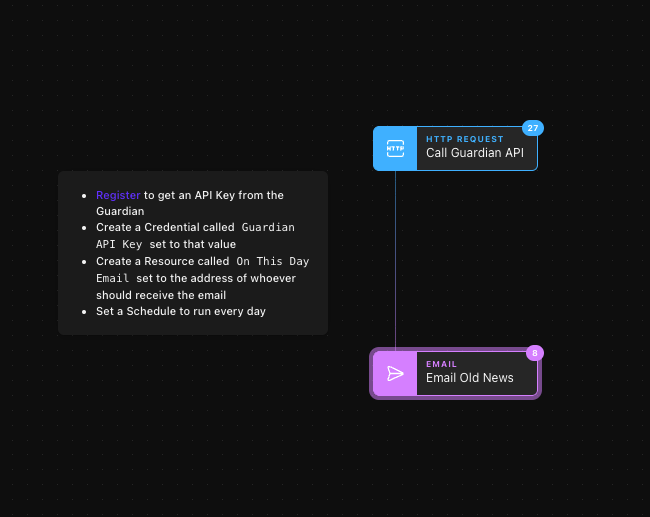
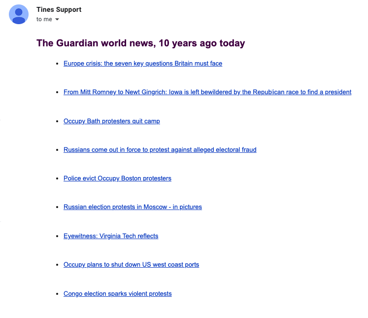

# Decade Old News by Email
This Story enables you to get 10 world news stories from today 10 years ago, in your Inbox each morning, from [The Guardian newspaper API](https://open-platform.theguardian.com/access/).

Setup is very straightforward:

* Download the [JSON file](10-world-news-stories-from-10-years-ago.json)
* Import it into your Tines account
* Follow the remainder of the instructions in the Annotation inside the Story

### Story

### Output

