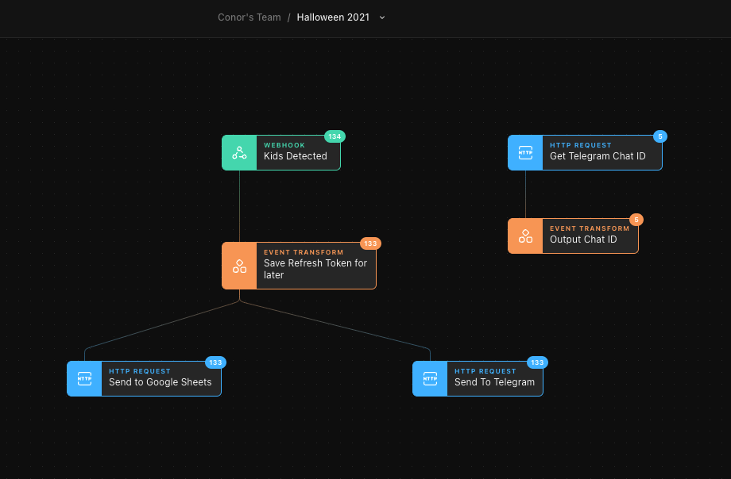

# Halloween Hacking
[Conor O'Neill](https://twitter.com/conoro) wrote a [blogpost](https://conoroneill.net/2021/11/01/no-code-halloween-hacking-with-blockly-espruino-node-red-tines/) about his attempt to do a Halloween scare setup in Ireland using only No-Code tools.

It involved Blockly, [Espruino](https://www.espruino.com), [Node-RED](https://nodered.org/) and [Tines](https://www.tines.com).

The Tines Story takes notifications on a webhook from Node-RED running on a Raspberry Pi that there are people approaching the door and does two things:

* Sends a notification on Telegram 
* Logs the timestamp to Google Sheets

You can [download the Story here](halloween-2021.json) and import it into your Tines account.

Eventually Conor should do some Halloweenalytics on the timestamps to optimise sweet/candy supply chains ;-)

To run this Story you'll need to follow [the instructions in an earlier post](https://conoroneill.net/2021/09/20/using-tines-for-home-iot-automation/) about configuring access to both Google Sheets and Telegram. It's not hard but there are quite a few steps.

