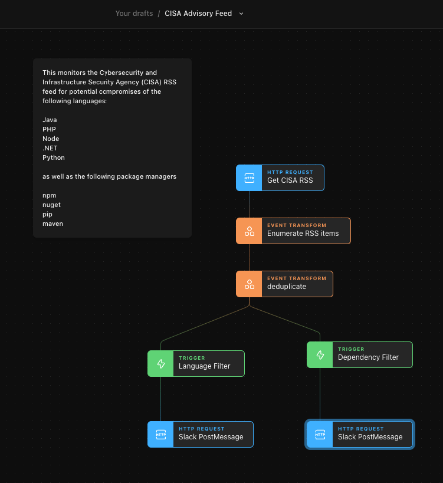

# CISA Advisory Feed as Slack Alerts
This Story from Tines Community member [Kurt Boberg](https://twitter.com/lapt0r) ingests the [CISA](https://www.cisa.gov/) RSS feed, greps for common languages/package managers, and emits to Slack.

As Kurt said "If you're a Java shop and not already panicking over log4j2, you probably should be."

## Setup
* Import [the Story](cisa-advisory-feed-slack.json) into your Tines account
* Then set {{.CREDENTIAL.YOUR_BOT_TOKEN}} to your Slack Bot Token
* It's currently set to run once per hour

## Story

