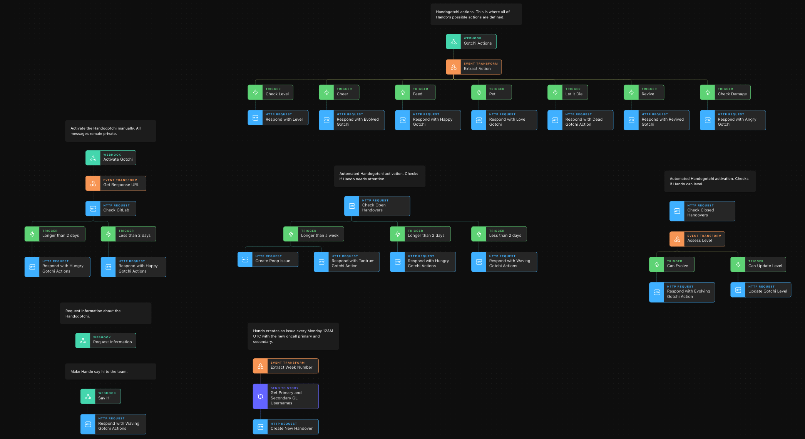

# Handogotchi
Handogotchi was created by Valentine Mairet, a Security Engineer at GitLab, as her entry into the YDWWT Winter Wonderland competition. This fantastic tool uses the best of Tines along with the best of the Slack APIs to ensure handovers happen between teams.

The version we have here is not runnable directly. It is more intended to show how a powerful Slack bot can be created using Tines. You will need to replace many of the plaeholder URLs and Credentials/Resources with your own to get a functioning system.

* Download the [JSON file](handogotchi.json)
* Import it into your Tines account
* Explore and learn

## Story

