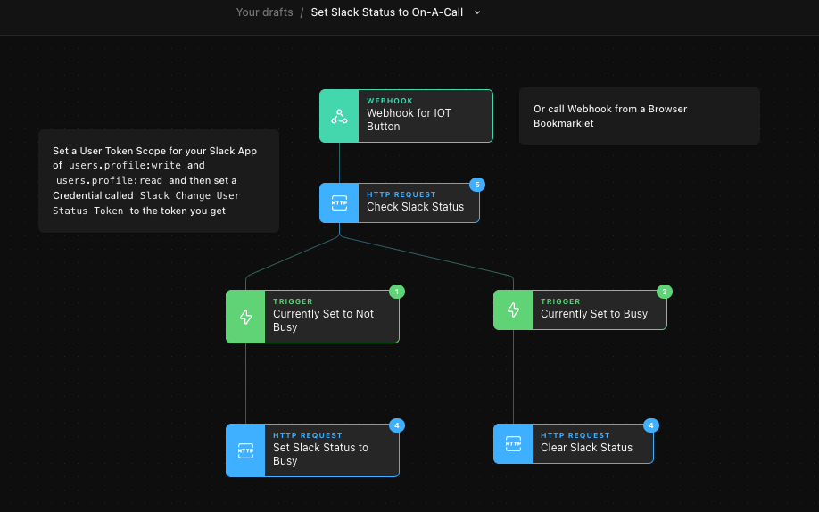

# Slack Status Changer
This Story enables you to toggle your Slack Status from clear to "On A Call" using a Webhook. You could invoke that webhook from:

* An IOT Button
* A browser bookmarklet
* A phone tool like Tasker
* An integration with something else

Setup is very straightforward:

* Download the [JSON file](set-slack-status-to-on-a-call.json)
* Import it into your Tines account
* Follow the remainder of the instructions in the Annotation inside the Story

